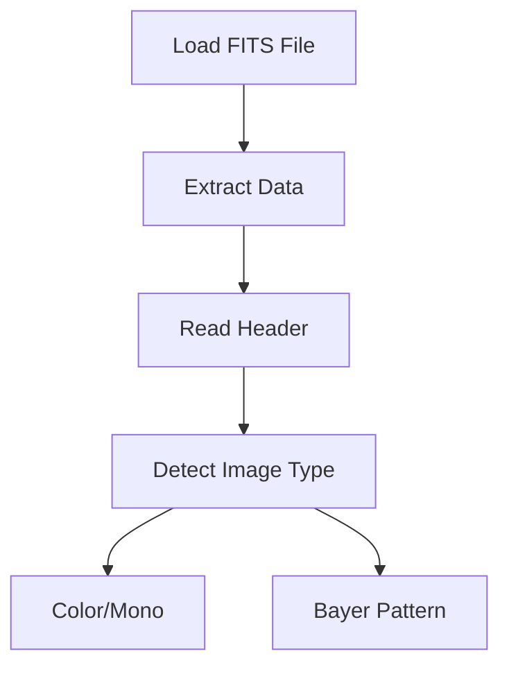
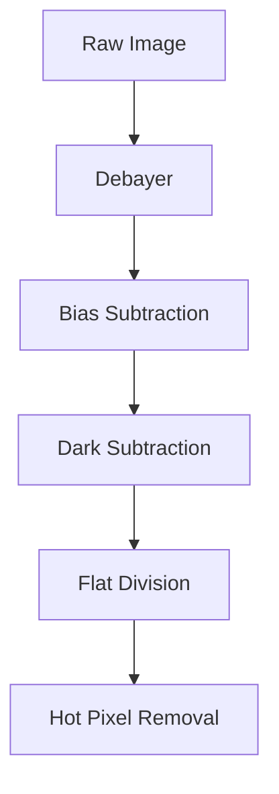
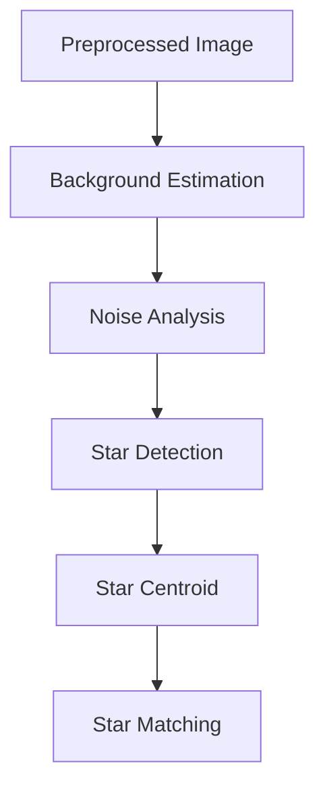
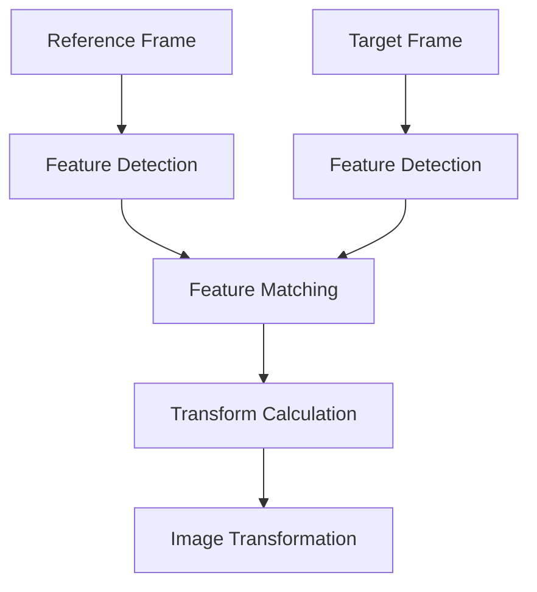
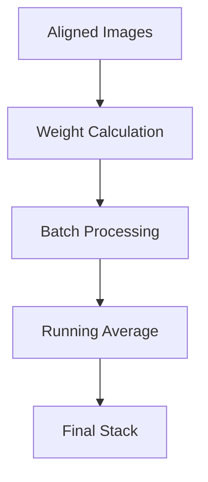
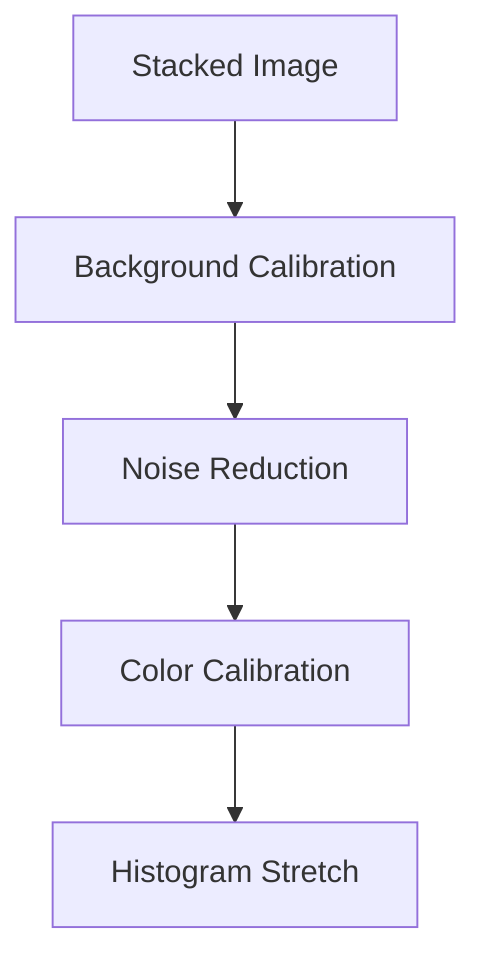

# Image Processing Pipeline

This document describes the image processing pipeline used in Stargazer for stacking and processing astronomical images.

## Overview

The pipeline consists of several stages, each optimized for accuracy and efficiency:

1. Image Loading
2. Pre-processing
3. Star Detection
4. Alignment
5. Stacking
6. Post-processing

## Detailed Pipeline Stages

### 1. Image Loading



- Supports FITS format
- Automatic color detection
- Bayer pattern recognition
- Header metadata extraction
- Efficient memory management

### 2. Pre-processing



#### Debayering (Color Images)
- Pattern-specific algorithms
- Color balance preservation
- OpenCV-based processing

#### Calibration
- Bias frame subtraction
- Dark frame scaling and subtraction
- Flat field correction
- Temperature scaling

### 3. Star Detection



#### Algorithm
```python
def detect_stars(self, image):
    """Star detection using photutils"""
    # Background estimation
    bkg = Background2D(data, (50, 50))
    data_sub = data - bkg.background
    
    # Star detection
    mean, median, std = sigma_clipped_stats(data_sub)
    daofind = DAOStarFinder(fwhm=3.0, threshold=5.*std)
    sources = daofind(data_sub)
    
    return sources
```

### 4. Alignment



#### Process
1. Reference frame selection
2. Feature detection using astroalign
3. Point matching
4. Transform matrix calculation
5. Image transformation

```python
def align_image(self, data, reference):
    """Image alignment using astroalign"""
    try:
        # Preprocess images
        data_proc = gaussian_filter(data, sigma=1.0)
        ref_proc = gaussian_filter(reference, sigma=1.0)
        
        # Use astroalign for registration
        aligned_data, transform = astroalign.register(data_proc, ref_proc)
        return aligned_data, transform
    except Exception as e:
        print(f"Error in image alignment: {str(e)}")
        return None, None
```

### 5. Stacking



#### Methods
1. Average Stacking
   - Running weighted average
   - Memory efficient
   - Parallel processing

2. Batch Processing
   ```python
   def process_batch(self, batch_data, current_stack, start_idx):
       """Process image batch efficiently"""
       valid_count = 0
       
       for data in batch_data:
           aligned_data = self.align_image(data, current_stack)
           if aligned_data is not None:
               if valid_count == 0:
                   current_stack = aligned_data
               else:
                   weight = 1.0 / (valid_count + 1)
                   current_stack = current_stack * (1 - weight) + aligned_data * weight
               valid_count += 1
       
       return current_stack, valid_count
   ```

### 6. Post-processing



#### Operations
1. Background Calibration
   - Gradient removal
   - Background neutralization

2. Noise Reduction
   - Wavelength-aware denoising
   - Edge preservation

3. Color Calibration (Color Images)
   - White balance
   - Color saturation
   - Channel alignment

## Memory Management

### Efficient Processing
```python
def estimate_optimal_batch_size(self, image_shape, is_color, available_memory):
    """Calculate optimal batch size based on available memory"""
    # Calculate memory needed per image
    if is_color:
        bytes_per_image = np.prod(image_shape) * 3 * 4  # float32 = 4 bytes
    else:
        bytes_per_image = np.prod(image_shape) * 4
        
    # Account for processing overhead
    overhead_factor = 3.0
    memory_per_image = bytes_per_image * overhead_factor
    
    # Calculate batch size
    max_batch_size = min(16, available_memory // memory_per_image)
    return max(2, max_batch_size)
```

### Memory Optimization
- Streaming processing for large datasets
- Memory-mapped file handling
- Efficient array operations
- Batch size optimization

## Error Handling

```python
def process_with_fallback(self, func, *args):
    """Process with error handling"""
    try:
        return func(*args)
    except Exception as e:
        print(f"Processing error: {str(e)}")
        return None
```

## Progress Tracking

### Callbacks
```python
def process_images(self, files, callbacks):
    """Process images with progress tracking"""
    total = len(files)
    for idx, file in enumerate(files):
        callbacks.progress(idx / total)
        callbacks.status(f"Processing {os.path.basename(file)}")
        # Processing logic
    callbacks.complete()
```

## Performance Optimization

### CPU Optimization
- Parallel processing using multiprocessing
- Vectorized operations with numpy
- Cache-friendly algorithms
- Optimized memory usage

## Future Improvements

1. Pipeline Enhancements
   - Additional stacking methods
   - Advanced noise reduction
   - Improved star detection

2. Performance
   - Enhanced memory management
   - Optimized parallel processing
   - Improved batch processing

3. Features
   - Real-time preview updates
   - Advanced calibration options
   - Custom processing filters
